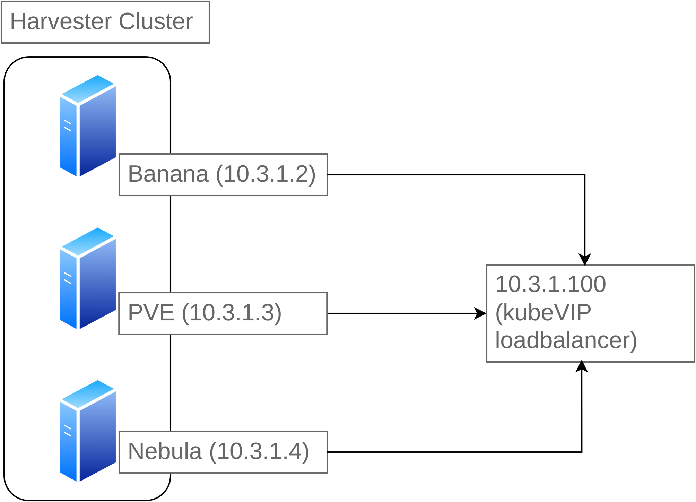

# Docs for the Docs

## Harvester Cluster
* Main VM cluster for everything!! And will be the backbone of the whole operation. 
* ONLY admins will have the password for accessing Harvester.

## Production Cluster
* Kubernetes cluster for all containers. 
* Things like CTFs will be hosted in this cluster or containers for events and other critical infrastructure that can be containers.

### Cluster Nodes

* KubeVIP will serve as a load balancer to ensure cluster high availability
* K3S would be the best distribution for this setup with local path storage class.
* RKE2 could be supplemented instead if optimal/needed for more customization.

