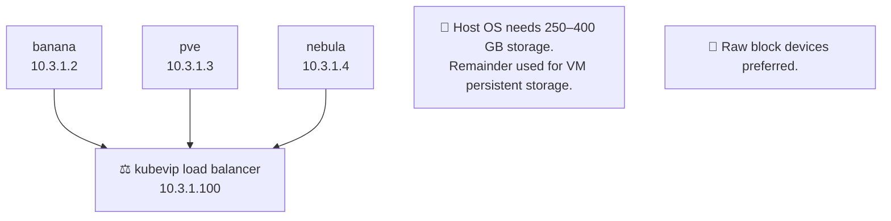

# Docs for the Docs

## Harvester Cluster
* Main VM cluster for everything!! And will be the backbone of the whole operation. 
* ONLY admins will have the password for accessing Harvester.

## Production Cluster
* Kubernetes cluster for all containers.
* Keys stored, backedup, and managed on Next Cloud inside of a VM.
* Things like CTFs will be hosted in this cluster or containers for events and other critical infrastructure that can be containers.

### Cluster Nodes

* KubeVIP will serve as a load balancer to ensure cluster high availability
* Talos will be used for stability and atomicity as well as ease for rolling back updates

### Key management

* Keys will be stored on nextcloud as a backup when keys get lost
* Oauth with itatem will be used as a source of truth to allow existing volunteers with itatem accounts to access their keys if lost.
* Nexcloud will be a virtual machine inside of harvester or on a completely seperate server.
